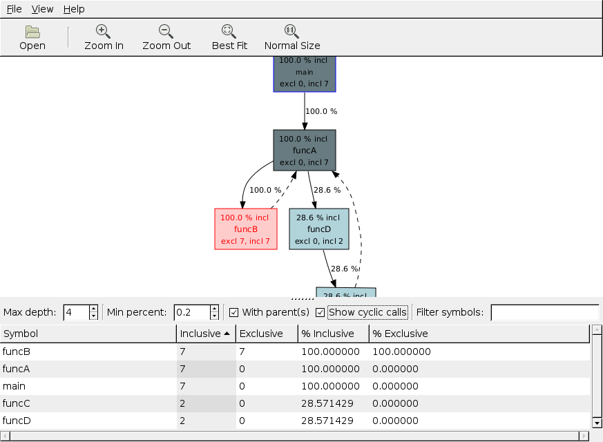
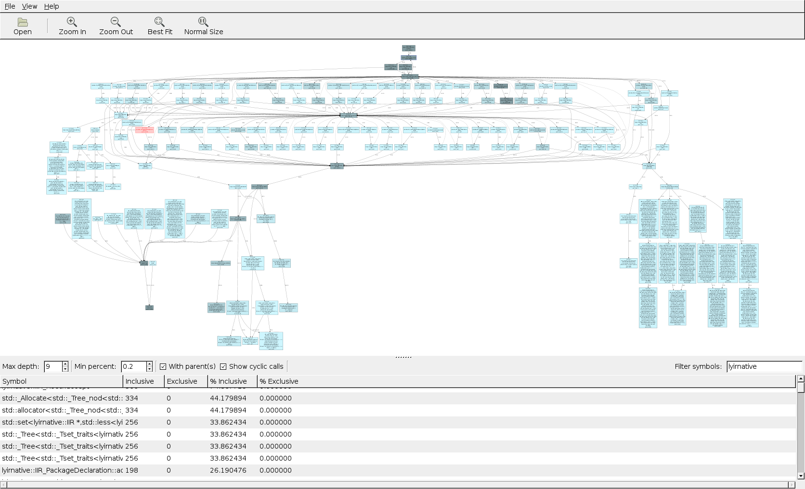

# SleepyGraph - visualizer for VerySleepy profiler

This is not generally obsolete, but at the tinme (2009) there was no better 
way to visualize Windows programs CPU profile (at that time in this regard VS sucked both Balmmer's and
Gates' asses, along with the mosquitoes, but being VS being so bad, it didn't give them malaria

Adding it here because it was useful piece of code handling cyclic refences, etc.
Albeit Python 2.

Don't have any more snapshot from VerySleepy.

Just a few screenshots.

## What is it is/was

There was once VerySleepy profiler that worked waaaaaaaaaaaay better than VS on Windows around 2009.
It didn't crash (ooooh!). Author accepted my fixes and it was happily ever after.

This piece is `xdot` extension and graphing that is interactive, trimming branched as they got deeper
around the vertex, filtering by name and percentage.

Only a few screenshots remained.

## Examples screenshots what you could discover when reviewing saved profile of a program

### Basic graph example with cycles

### Actual large callgraph of large application (HDL modeling tool, Verilog/VHDL/MAST parser, designer)

